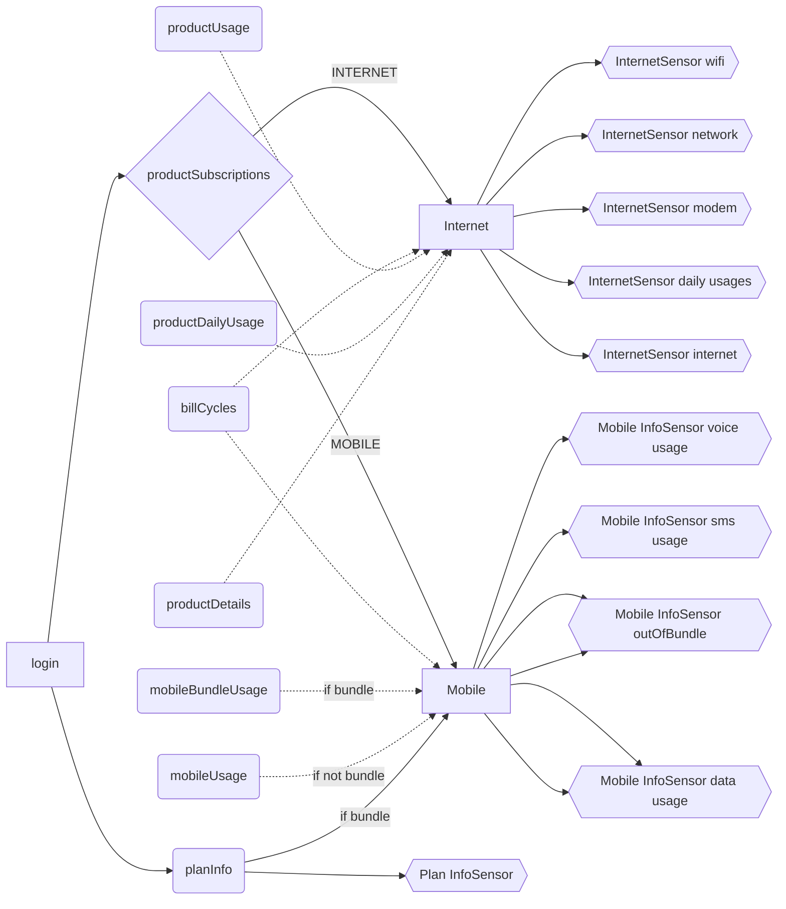

<!-- [START BADGES] -->
<!-- [END BADGES] -->

# Telenet for Home Assistant

Telenet custom component for Home Assistant, allowing to monitor your mobile and internet usage

## Installation
- [HACS](https://hacs.xyz/): search for Telenet in HACS integrations and download it
- Restart Home Assistant
- Add the 'Telenet' integration via HA Settings > 'Devices and Services' > 'Integrations'
- Provide your Telenet BE username and password

## Screenshots
|Description|Screenshot
|-|-
Config flow|
All-Internet & Usage Based Pricing sensors|
Internet sensors|
Internet sensor|
Plan sensor|
ONE for 2 bundle sensors|

## Lovelace examples
### Network & Wifi info

<details><summary>Show markdown code</summary>

**Replace &lt;identifier&gt; by your Telenet identifier**

```
type: markdown
content: >
  ## &nbsp;&nbsp;Telenet <identifier>

  ## Modem info

  |||

  |----:|----:|

  |**Type**|{{state_attr("sensor.telenet_internet_<identifier>_network","modemType")}}|

  |**Model**|{{state_attr("sensor.telenet_internet_<identifier>_network","model")}}|

  |**Last
  seen**|{{state_attr("sensor.telenet_internet_<identifier>_network","lastSeen")}}|

  |**Last seen
  light**|{{state_attr("sensor.telenet_internet_<identifier>_network","lastSeenLight")}}|


  ## Network clients

  |Name|IP|Interface|Vendor

  |----:|----:|----:|----:| 

  {{item["name"]}}||{{ip["ipAddress"]}}

  |{{item["connectedInterface"]}}|{{item["vendor"]}}


  ## Wifi Settings

  |||

  |----:|----:|

  |**Wireless
  enabled**|{{state_attr("sensor.telenet_internet_<identifier>_wifi","wirelessEnabled")}}|

  |**HomeSpot
  enabled**|{{state_attr("sensor.telenet_internet_<identifier>_wifi","homeSpotEnabled")}}|

  |**Wps
  enabled**|{{state_attr("sensor.telenet_internet_<identifier>_wifi","wifiWpsEnabled")}}|
```
</details>

## Sensors logic
The integration creates for each subscription linked to your account the following sensors

The following flowchart is rendered using mermaid. If you see code instead, you can always see the flowchart [here](https://github.com/geertmeersman/telenet).


