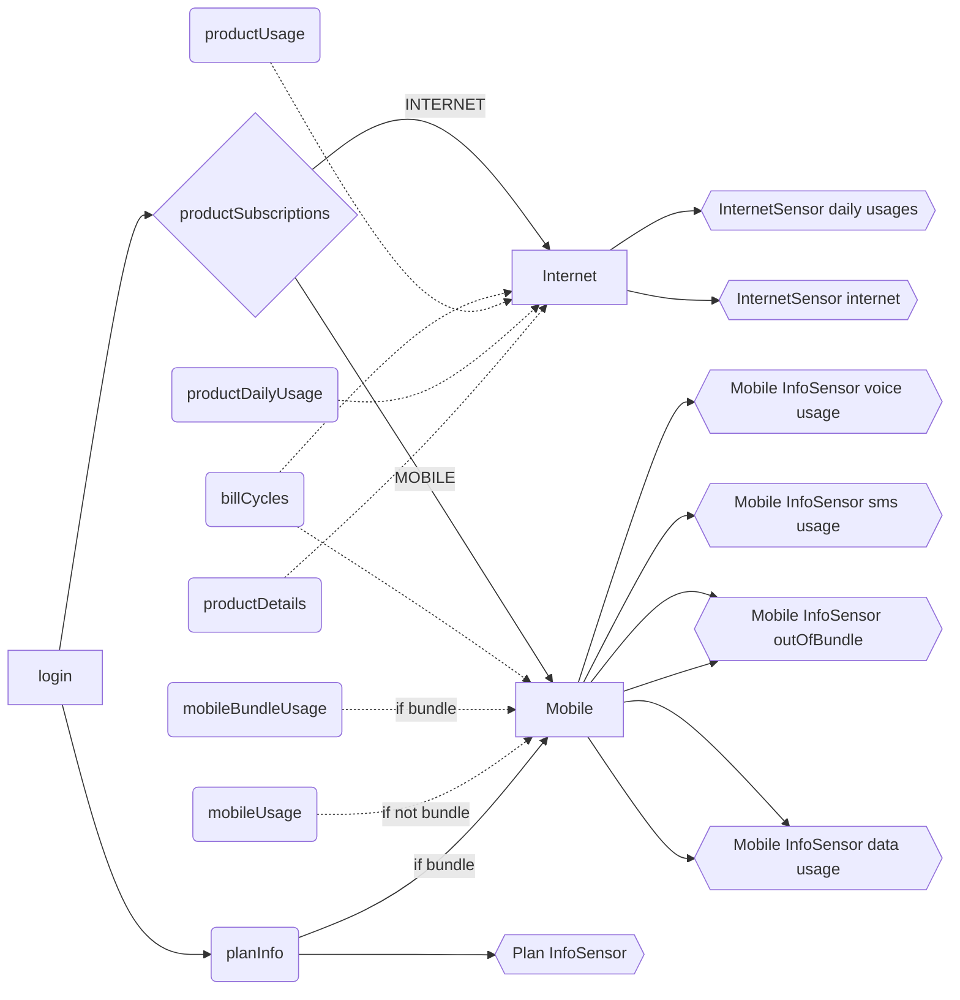

# Telenet for Home Assistant

Telenet custom component for Home Assistant, allowing to monitor your mobile and internet usage

## Installation
- [HACS](https://hacs.xyz/): search for Telenet in HACS integrations and download it
- Restart Home Assistant
- Add the 'Telenet' integration via HA Settings > 'Devices and Services' > 'Integrations'
- Provide your Telenet BE username and password

## Sensors logic
The integration creates for each subscription linked to your account the following sensors

