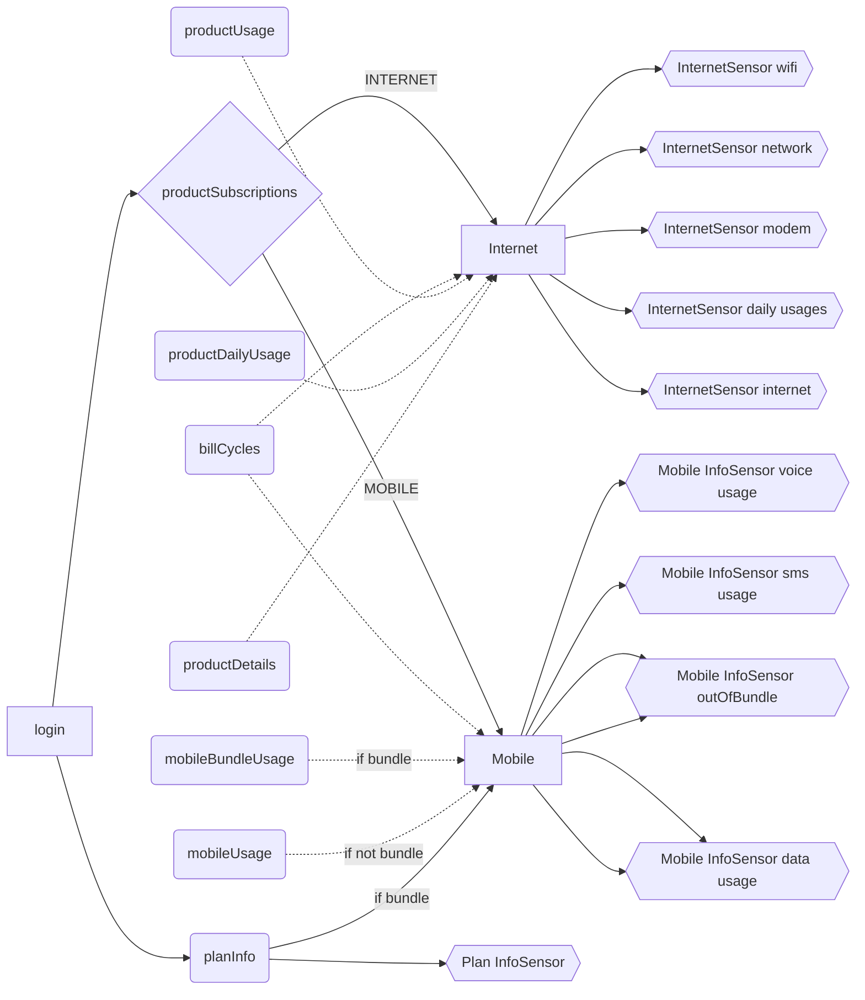

## Sensors logic
The integration creates for each subscription linked to your account the following sensors

```mermaid
flowchart LR
    planInfo(planInfo)
    productUsage(productUsage)
    productDailyUsage(productDailyUsage)
    productSubscriptions{productSubscriptions}
    productDetails(productDetails)
    mobileBundleUsage(mobileBundleUsage)
    mobileUsage(mobileUsage)
    Mobile
    Internet
    login --> planInfo
    login --> productSubscriptions
    productSubscriptions --> |INTERNET| Internet
    productSubscriptions --> |MOBILE| Mobile
    billCycles(billCycles)
    billCycles -.-> Internet
    billCycles -.-> Mobile
    productUsage -.-> Internet
    productDailyUsage -.-> Internet
    productDetails -.-> Internet
    mobileBundleUsage -.-> |if bundle| Mobile
    mobileUsage -.-> |if not bundle| Mobile
    planInfo --> |if bundle| Mobile
    Internet --> InternetSensor{{InternetSensor internet}}
    Internet --> InternetSensorDU{{InternetSensor daily usages}}
    Internet --> InternetSensorModem{{InternetSensor modem}}
    Internet --> InternetSensorNetwork{{InternetSensor network}}
    Internet --> InternetSensorWifi{{InternetSensor wifi}}
    planInfo --> PlanInfoSensor{{Plan InfoSensor}}
    Mobile --> MobileInfoSensor_outOfBundle{{Mobile InfoSensor outOfBundle}}
    Mobile --> MobileInfoSensor_DataUsage{{Mobile InfoSensor data usage}}
    Mobile --> MobileInfoSensor_DataUsage{{Mobile InfoSensor data usage}}
    Mobile --> MobileInfoSensor_sms{{Mobile InfoSensor sms usage}}
    Mobile --> MobileInfoSensor_voice{{Mobile InfoSensor voice usage}}
    Mobile --> MobileInfoSensor_outOfBundle{{Mobile InfoSensor outOfBundle}}
```
